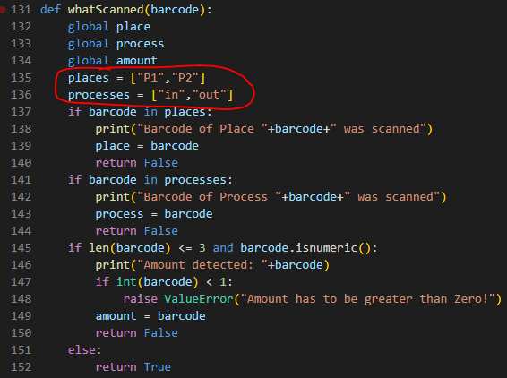

# Warehouse Management System (WMS)
#### Video Demo:  <https://youtu.be/aOk7QZqcWzg>
#### Description:

The Warehouse Management System can be used in order to manage mutliple items in a SQLite Database.

The Programm will use an SQLite database ("wms01.sqlite) for storing the general information about items, storage locations (places) and the amount of stored items inside the warehouse.

## Start the Programm

The programm is started by typing

    python project.py

It will check if the database exists, and if not create the database with all needed tables.

The three inital tables and coressponding columns of this programm are:
* tbl_items
    * id INTEGER PRIMARY KEY,barcode,name,valid_from,valid_to
* tbl_places
    * id INTEGER PRIMARY KEY,barcode,name,valid_from,valid_to
* tbl_warehouse
    * id INTEGER PRIMARY KEY,timestamp,place,item,amount

You can see, that the database and coressponding tables are sucessfully created, by the printed output of the script.

Furthermore, the programm is now asking to scan an item, that you want to store in the place called "P1".

You can also notice, that the created database is now shown in the directory.

The principle idea of this Warehouse Management System is, that it can be controlled by usind a 1D-barcode scanner. Therefore you can either innput commands manually by using your keyboard or simply scan the commands with the barcode-scanner.

This scanners can read a wide variety of barcodes.
In the following examples, the type of the used Barcode is "Code-128".

Now lets habe a look at the controling functions of the system.
As you can see in the image below, two main processes are implemented.

* Store
* Outsource

The current process of the system can be changed by inputing either

    in

for storing items inside the warehouse or

    out

for outsourcing items from the warehouse.

The second information that it needed by the system, is the location or place, where you want to store or outsource the item.

Therefore, by default, two places inside the warhouse are defined.

P1 and P2.

This is defined in the function "whatScanned" that will check for every input wether it is a known place or a known process.

Furthermore, all inputed numbers, smaller than 1000 will be considered as amount of items that is processed.

If no place, process of number smaller 1000 is detected, the function will assume, that an item was scanned and return "True".

The message, prompting the user to scan a barcode, will adapt, considering the active place and process.

So let's see what happens if we input

    P2

The system detects, that a known place was scanned and changes the shwon message:

The same principle is used in order to change the process from storing an item

    in

and outsourcing and item

    out

Furtermore, if we want to outsource 4 items we simply input

    4

Be carefull in the beginning, as you are starting with an empty warehouse, you cant outsource any items.

If you try to do so, the code will tell you, that it can't outsource an unknown item:

## Beginn storing items

For the beginning, just let's assume that we want to store a package of a sensor inside the place "P1" of our warehouse.

Therefore, the barcode on the packages side is scanned.

The system recognizes, that a item was scanned and tries to identify the item by searching for it in the database.

Because the item is not known, the system outputs:

    Article  6973956303423  not found!

The user is then asked, if the article shall be added to the database.

This is confirmed by typing in:

    y

Now the user is asked for the name of the scanned article:

After inputting the desired name (String), the transaction is executed.

It can be seen, that a dataset with the ID "1" is added at 26th November of 2022.
The dataset furthermore stores the information, that 1 item of the article "6973956303423" is stored in "P1".

If the same item is scanned again, the amount of stored items is increased to a new amount of 2 items. The "ID" of the dataset remains the same, only the amount of items and timestamp is updated.

## Outsource items

Items are outsourced of the warehouse by changing the current process to out:

    out

After changing the active process, the item is outsourced by scanning the barcode of the item.

But be careful!

If you try to outsource more articles than are stored inside the warehouse, the system will raise a ValueError.

# Aftermath

The same principle as described above can be used for different places inside the warehouse and for different amounts of items.

In general, the system can be extended by multiple dimensions etc.

Additional functions could be implemented in the future, e.g. for annual inventory.

If you have any issues with my code, don't hesitate to contact me!

### Thank you very much!